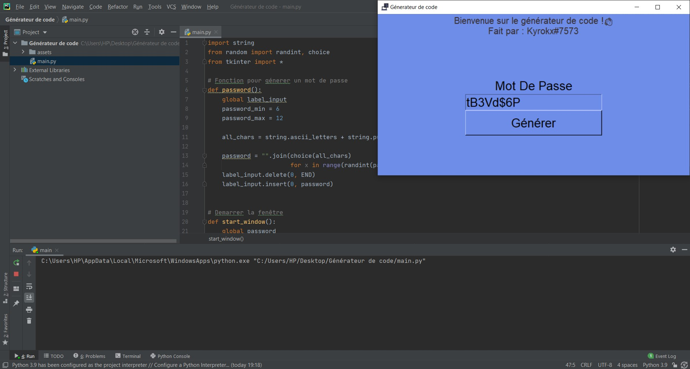

### Screen de l'interface

### Conditions préalables

Assurez-vous que les bibliothèques suivantes sont installées dans votre environnement Python:

- tkinter
- string
- random

### Informations

Inspirer de la vidéo du youtubeur [graven](https://youtu.be/N4M4W7JPOL4) un developpeur 

**Mon tag Discord**: Kyrokx#7573

IDE : PyCharm

## Licence

Ce projet est sous licence MIT - voir le fichier [LICENSE.md](LISENCE.md) pour plus de détails